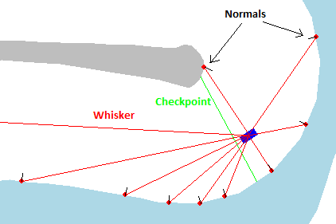

# NEAT_Drifter

NEAT_Drifter is a machine learning application that aims to teach a 2d car to drive in an aribtrary hand-drawn racecourse faster than a human driver can.

The [NEAT (Neuro-Evolution of Augmented Topologies)](http://nn.cs.utexas.edu/downloads/papers/stanley.cec02.pdf) genetic algorithm is used to train a dense [recurrent Neural Network](https://en.wikipedia.org/wiki/Recurrent_neural_network) to drive the vehicle in a [Box2D physics environment](https://en.wikipedia.org/wiki/Box2D) with [Pygame graphics](https://www.pygame.org/news). It is fully multi-processed and will take advantage of all of your CPU cores to compute generations.

## Description

The drifter car "sees" with "whiskers." Each whisker give the distance from the center of the car to the wall along it's length. It also obtains the normal vector at the point where the ray impacts the wall, allowing the NN to see which direction the wall is facing relative to itself. The car presently has 10 whiskers, although I have experimented with as few as 2 and as many as 40 whiskers. There is a computational time penalty for using more whiskers. 

The Neural Network takes 21 inputs and produces 4 outputs. The inputs include the 10 whisker distances, the 10 corresponding whisker normals (dotted with the car's direction) and the car's current speed (including negative values for reverse). The 4 outputs are the 4 directional keys (up, down, left, right) and are used to control the car in exactly the same way as a human driver. 

A generation consists of 200 individual Neural Networks, stored as genomes. A genome's fitness score is based on three things: not hitting walls (the simulation ends if it does), passing checkpoints, and high speeds. During each generation, individual genomes are handed off to one of 12 subprocesses for evaluation. Each genome controls its own car in a separate physics environment and is given three chances to drive the track at three random starting locations. Its final sum fitness is used for breeding. In each generation, the highest quintile of genomes according to fitness score are allowed to breed. The next generation is then evaluated, and the process repeats. 

Generations can train in less than one second, or as long as a few minutes. This will depend on a few factors including number of genomes in a generation (presently 200 but has been as high as 1000), genome size (number of nodes/connections in each genome), number of whiskers, simulation time per trial, and the number of dedicated CPU cores the process has. Results can be seen in as few as five generations, although allowing thousands of generations to train overnight yields some impressive results. Its also great for cooking eggs on your CPU. 

At present, exceptional results can be achieved on most drawn tracks with less than an hour of training time. See the "tracks" folder for several default tracks or draw your own with the TrackGenerator tool. 

## Usage

The main project resides in "NEAT_Drifter.py." Run that file to begin the track generator. After the track is complete, the NN begins training. If you run the program with an 'm' argument, you can drive the car manually around your track. You can also use a 't' argument to load the default track automatically.

When training, the main window only displays the best individual after each generation. In-between generations it may become unresponsive. The main terminal displays statistics from each generation. 

Press S to change playback speed and G to toggle graphics on/off

There is an experimental command mode that currently only changes simulation time. With graphics on, type “c” to enter command mode, then “runtime xxx” to change the number of frames it simulates. You’ll see it in the top left. Default is 400 frames, I usually increase it as the car improves.

Settings relating to the Neural Network are stored in "NEAT_config.py." Feel free to twist knobs and see what happens. Details are [here](https://neat-python.readthedocs.io/en/latest/config_file.html)

## Upcoming features

1. Control panel for simulation, playback details, editing NN configuration on the fly.
2. GUI for storing and loading NN's, tracks
3. Graphs/histograms showing many statistics, including fitness over time, generation times, fitness per frame, 
4. Race mode, where you can race against the AI in real-time (you're going to lose)

## Installation

I dont recommend that anyone tries to install this themselves. But if you do, maybe this will help:

1.	You’ll need anaconda set up. You’ll also need a number of libraries installed, including: 
  *Pygame
  *Pymunk
  *PyBox2D
  *Numpy
  *Neat (you’ll find it on google under “neat-python”)

2. I had to heavily modify the multiprocessing part of the neat library file to make multiprocessing work. You will need to find your neat-python installation and manually replace the files 'parallel.py' and 'population.py' with the versions found here in this repository

## Bugs and Todo:

This section isnt relevant to you unless youre Nick coming back to this project months after dropping it, in which case you need to get your ass to work. 

prevent timeout computational time penalties by killing simulations where the fitness does not increase for X frames
there is that annoying collision bug. Might have to add a collision reporter (?) in box2d to catch every single collision
make it faster by profiling it with cprofile
maybe if you implement a continuous gate reward function the actor-critic network will work?
checkpoint size growth bug, use recursive getsizeof() function to pinpoint it.
Overflow bug
auto-set frame limits (simulation time) based on % completion
NN visualizer
gate-skipping when crashbad disabled bug
gates per point bug/ incompatability with old/new tracks (5 GPP vs 20)
move pygame and graphics to separate class
make Drifter and MPDrifter inherit from the same base class so you dont have to keep copying over changes
weird bug where training stops until i type any letter into the command line. there shouldnt be any inputs or breaklines...

## License
[MIT](https://choosealicense.com/licenses/mit/)
